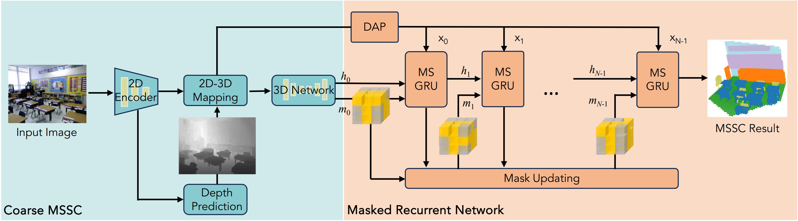

# MonoMRN: Monocular Semantic Scene Completion via Masked Recurrent Networks

<h3 align="center">
Xuzhi Wang<sup>1</sup>  Xinran Wu<sup>1</sup>  Song Wang<sup>2</sup>  Lidong Kong<sup>3</sup>  Ziping Zhao<sup>1</sup>
</h3>

<p align="center">
<sup>1</sup>TJNU
<sup>2</sup>ZJU
<sup>3</sup>NUS
</p>


## 🧠 Overview

**Monocular Semantic Scene Completion (MSSC)** aims to infer voxel-wise occupancy and semantic labels from a **single RGB image**. Existing methods typically rely on **single-stage pipelines** that jointly handle visible segmentation and occluded region hallucination. However, these methods often suffer from **depth estimation errors** and limited generalizability to complex scenes.

**MonoMRN** is a novel **two-stage framework** designed to address these challenges:

1. **Stage 1: Coarse MSSC**
2. **Stage 2: Masked Recurrent Network (MRN)**  
   ‣ Focuses on refining occluded regions  
   ‣ Utilizes a **Masked Sparse Gated Recurrent Unit (MS-GRU)** to focus on occupied regions  
   ‣ Integrates a **Distance Attention Projection** to reduce projection errors

---
<p align="center">
  
</p>


## ✨ Highlights

- 🔁 **Masked Sparse GRU (MS-GRU):** Efficient recurrent unit that updates only occupied voxels
- 🎯 **Distance Attention Projection:** Improves feature projection accuracy
- 🏠 + 🚗 **Indoor & Outdoor Scenes:** Works seamlessly on **NYUv2** and **SemanticKITTI**


```markdown
@inproceedings{wang2025MonoMRN,
  title={Monocular Semantic Scene Completion via Masked Recurrent Networks},
  author={Wang, Xuzhi and Wu, Xinran and Wang, Song and Kong, Lingdong and Zhao, Ziping},
  booktitle={Proceedings of the IEEE/CVF Conference on International Conference on Computer Vision (ICCV)},
  year={2025}
}
